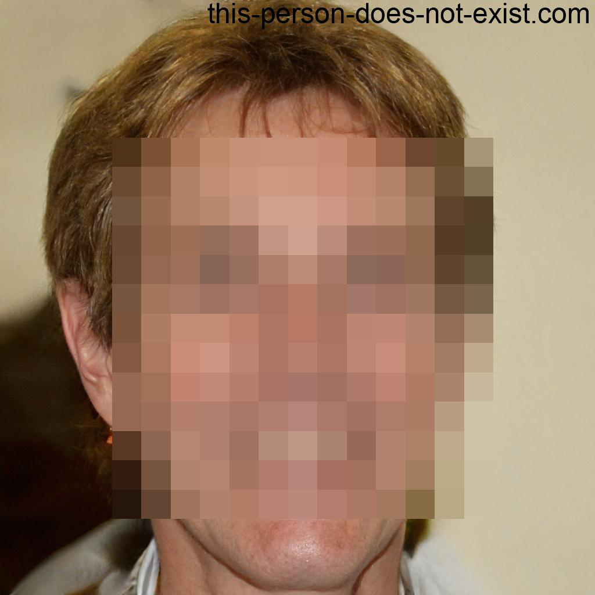

## Kura

Face detection & anonymizer tool written in Rust. It ain't perfect, but it works

### Installation
Build it using `nightly` instead.
If you want to debug, use release since it'll take a 
while to detect faces in debug mode

### Usage
```
kura --filter <filter (optional): gaussian, pixelated, pixel-blur> \
      --model <path/to/model (optional)> 
       <path/to/image> <path/to/output>
```

## Preview

| Original                                      | Output                                            |
|-----------------------------------------------|---------------------------------------------------|
|  |  |
